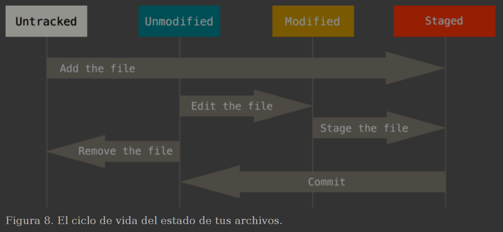

https://git-scm.com/book/es/v2/

## COMANDOS GIT
    git status

#### Ver las ramas
    git branch

Ver ramas ya fusionadas o no con master
    git branch --merged (--no-merged) master

Borrar la rama xxx
    git branch -d xxx

## ANTES DE HACER COMMIT
#### Saca un archivo modificado del 'stage' (zona de preparación) para el siguiente commit sin perder sus cambios
    git restore --staged nombre_del_archivo

    git status              Ver archivos que serán incluidos en el commit
    

